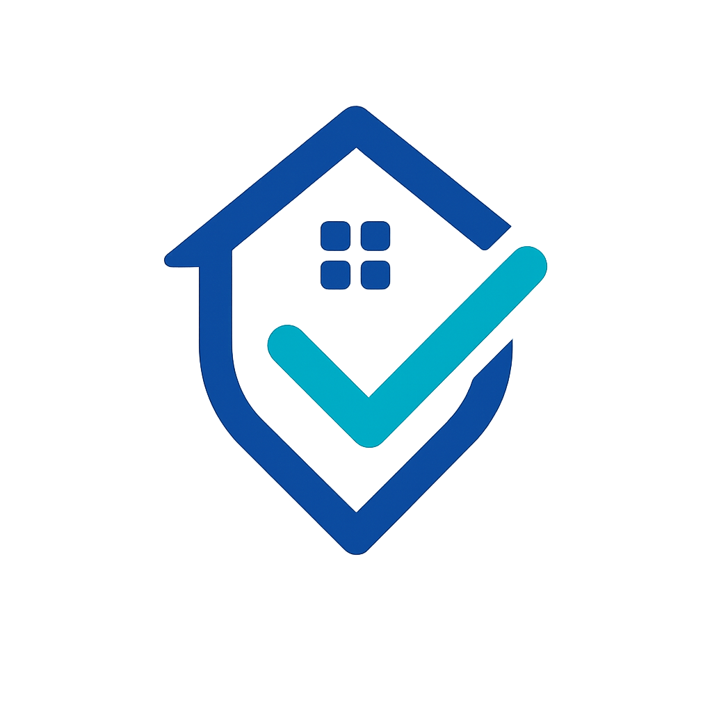

<div align="center">
  
  
  # Trendly - Smart Expense Tracker
  
  ### Professional Expense Management Made Simple
  
  [](https://trendly-expense-tracker.netlify.app)
  [](https://reactjs.org/)
  [](https://www.typescriptlang.org/)
  [](https://vitejs.dev/)
  
  <p align="center">
    <a href="#features">Features</a> •
    <a href="#demo">Demo</a> •
    <a href="#installation">Installation</a> •
    <a href="#usage">Usage</a> •
    <a href="#tech-stack">Tech Stack</a>
  </p>
</div>

---

## 📖 About

**Trendly** is a modern, full-featured expense tracking application designed to help individuals and professionals take control of their finances. With an intuitive interface, real-time analytics, and comprehensive reporting tools, managing your expenses has never been easier.

Built with cutting-edge web technologies, Trendly offers a seamless experience across all devices with robust authentication, customizable categories, and insightful data visualizations.

---

## ✨ Features

### 💰 Core Functionality
- **Expense Management** – Add, edit, and delete expenses with ease
- **Smart Categorization** – Organize expenses with custom categories and color coding
- **Real-time Analytics** – Interactive charts showing spending patterns and trends
- **Monthly Summaries** – Track spending by month with detailed breakdowns
- **Search & Filter** – Quickly find expenses by category, date, or amount

### 🎨 User Experience
- **Dark/Light Theme** – Seamless theme switching for comfortable viewing any time
- **Responsive Design** – Optimized for desktop, tablet, and mobile devices
- **Beautiful UI** – Modern, clean interface built with shadcn/ui components
- **Loading States** – Smooth skeleton loaders for better perceived performance
- **Toast Notifications** – Clear feedback for all user actions

### 🔐 Authentication & Security
- **User Authentication** – Secure login and registration system
- **Protected Routes** – Dashboard and profile pages protected for authenticated users only
- **Profile Management** – Update user information and preferences
- **Session Persistence** – Stay logged in across browser sessions

### 📊 Visualization & Reporting
- **Interactive Charts** – Visual representation of spending by category
- **Expense Trends** – Monthly and yearly spending analysis
- **Category Breakdown** – Detailed insights into spending patterns
- **Empty States** – Helpful guidance when no data is available

---

## 🎬 Demo

**Live Demo:** [https://trendly-expense-tracker.netlify.app](https://trendly-expense-tracker.netlify.app)

### Screenshots

<div align="center">
  
  <p><em>Main Dashboard with Expense Overview</em></p>
</div>

---

## 🛠️ Tech Stack

### Frontend
- **[React 18](https://reactjs.org/)** – Modern UI library with hooks
- **[TypeScript](https://www.typescriptlang.org/)** – Type-safe JavaScript
- **[Vite](https://vitejs.dev/)** – Lightning-fast build tool and dev server

### Styling & UI
- **[Tailwind CSS](https://tailwindcss.com/)** – Utility-first CSS framework
- **[shadcn/ui](https://ui.shadcn.com/)** – High-quality React components built on Radix UI
- **[Lucide React](https://lucide.dev/)** – Beautiful, consistent icons

### State & Data Management
- **React Context API** – Global state management for expenses and theme
- **[TanStack Query](https://tanstack.com/query)** – Powerful data fetching and caching
- **LocalStorage** – Client-side data persistence

### Forms & Validation
- **[React Hook Form](https://react-hook-form.com/)** – Performant form handling
- **[Zod](https://zod.dev/)** – TypeScript-first schema validation

### Charts & Visualization
- **[Recharts](https://recharts.org/)** – Composable charting library

### Routing & Navigation
- **[React Router DOM](https://reactrouter.com/)** – Declarative routing for React

### Additional Libraries
- **[date-fns](https://date-fns.org/)** – Modern date utility library
- **[Sonner](https://sonner.emilkowal.ski/)** – Elegant toast notifications
- **[next-themes](https://github.com/pacocoursey/next-themes)** – Theme management

---

## 🚀 Getting Started

### Prerequisites

Before you begin, ensure you have the following installed:
- **Node.js** (v18.0.0 or higher)
- **npm** (v9.0.0 or higher) or **yarn** or **bun**

### Installation

1. **Clone the repository**
   ```bash
   git clone https://github.com/zacktam12/Trendly-ExpenseTracker.git
   ```

2. **Navigate to the project directory**
   ```bash
   cd Trendly-ExpenseTracker
   ```

3. **Install dependencies**
   ```bash
   npm install
   # or
   yarn install
   # or
   bun install
   ```

4. **Start the development server**
   ```bash
   npm run dev
   # or
   yarn dev
   # or
   bun dev
   ```

5. **Open your browser**
   
   Navigate to `http://localhost:5173` to see the application running.

---

## 📦 Available Scripts

In the project directory, you can run:

| Script | Description |
|--------|-------------|
| `npm run dev` | Starts the development server on `http://localhost:5173` |
| `npm run build` | Builds the app for production to the `dist` folder |
| `npm run build:dev` | Builds the app in development mode |
| `npm run lint` | Runs ESLint to check for code quality issues |
| `npm run preview` | Previews the production build locally |

---

## 💻 Usage

### Getting Started with Trendly

1. **Create an Account**
   - Navigate to the signup page
   - Enter your name, email, and password
   - Click "Sign Up" to create your account

2. **Log In**
   - Use your credentials to log in
   - You'll be redirected to your personal dashboard

3. **Add Your First Expense**
   - Click the "Add Expense" button
   - Enter the amount, select a category, choose a date, and optionally add a note
   - Click "Save" to record your expense

4. **View Analytics**
   - Check the dashboard for visual insights
   - View spending by category with interactive charts
   - Track monthly totals and trends

5. **Manage Categories**
   - Expenses are organized by predefined categories
   - Each category has a unique color for easy identification

6. **Switch Themes**
   - Click the theme toggle button to switch between light and dark modes
   - Your preference is saved automatically

---

## 📁 Project Structure

```
Trendly-ExpenseTracker/
├── public/                 # Static assets
│   ├── logo.png           # App logo
│   ├── favicon.png        # Favicon
│   └── ...
├── src/
│   ├── components/        # React components
│   │   ├── ui/           # shadcn/ui components
│   │   ├── ExpenseDashboard.tsx
│   │   ├── ExpenseForm.tsx
│   │   ├── ExpenseList.tsx
│   │   ├── ExpenseChart.tsx
│   │   ├── MonthlySummary.tsx
│   │   ├── ThemeToggle.tsx
│   │   └── ...
│   ├── context/          # React Context providers
│   │   ├── ExpenseContext.tsx
│   │   └── ThemeContext.tsx
│   ├── hooks/            # Custom React hooks
│   │   ├── useAuth.tsx
│   │   ├── use-mobile.tsx
│   │   └── use-toast.ts
│   ├── pages/            # Page components
│   │   ├── LandingPage.tsx
│   │   ├── Login.tsx
│   │   ├── SignUp.tsx
│   │   ├── AuthenticatedIndex.tsx
│   │   ├── Profile.tsx
│   │   └── NotFound.tsx
│   ├── types/            # TypeScript type definitions
│   │   └── index.ts
│   ├── utils/            # Utility functions
│   │   └── dateUtils.ts
│   ├── lib/              # Library configurations
│   │   └── utils.ts
│   ├── App.tsx           # Main App component
│   ├── main.tsx          # Application entry point
│   └── index.css         # Global styles
├── dist/                 # Production build output
├── package.json          # Project dependencies and scripts
├── vite.config.ts        # Vite configuration
├── tailwind.config.ts    # Tailwind CSS configuration
├── tsconfig.json         # TypeScript configuration
└── README.md            # Project documentation
```

---

## 🌐 Deployment

This project is configured for easy deployment on **Netlify**.

### Deploy to Netlify

1. **Connect your repository** to Netlify
2. **Configure build settings:**
   - Build command: `npm run build`
   - Publish directory: `dist`
3. **Deploy!**

The `netlify.toml` file is already configured with optimal settings.

### Other Platforms

You can also deploy to:
- **Vercel** – Zero-config deployment for Vite apps
- **GitHub Pages** – Free hosting for static sites
- **Cloudflare Pages** – Fast global CDN deployment

---

## 🤝 Contributing

Contributions are welcome! If you'd like to contribute to Trendly, please follow these steps:

1. **Fork the repository**
2. **Create a feature branch**
   ```bash
   git checkout -b feature/AmazingFeature
   ```
3. **Commit your changes**
   ```bash
   git commit -m 'Add some AmazingFeature'
   ```
4. **Push to the branch**
   ```bash
   git push origin feature/AmazingFeature
   ```
5. **Open a Pull Request**

Please make sure to update tests as appropriate and follow the existing code style.

---

## 👤 Author

**Zekarias Tamiru**

- GitHub: [@zacktam12](https://github.com/zacktam12)
- LinkedIn: [linkedin.com/in/zekariastamiru](https://www.linkedin.com/in/zekariastamiru)
- Email: zekariastamiru12@gmail.com

---

## 🙏 Acknowledgments

- [shadcn/ui](https://ui.shadcn.com/) for the beautiful component library
- [Lucide](https://lucide.dev/) for the icon set
- [Recharts](https://recharts.org/) for the charting library
- [Tailwind CSS](https://tailwindcss.com/) for the styling framework

---

## 📞 Support

If you have any questions or run into issues, please:
- Open an issue on [GitHub Issues](https://github.com/zacktam12/Trendly-ExpenseTracker/issues)
- Contact me at zekariastamiru12@gmail.com

---

<div align="center">
  <p>Made with ❤️ by Zekarias Tamiru</p>
  <p>⭐ Star this repository if you find it helpful!</p>
</div>
